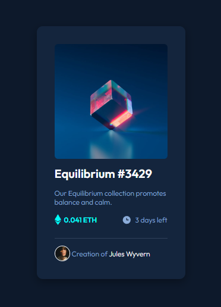

# Frontend Mentor - NFT preview card component solution

This is a solution to the [NFT preview card component challenge on Frontend Mentor](https://www.frontendmentor.io/challenges/nft-preview-card-component-SbdUL_w0U). Frontend Mentor challenges help you improve your coding skills by building realistic projects. 

## Table of contents

- [Overview](#overview)
  - [The challenge](#the-challenge)
  - [Screenshot](#screenshot)
  - [Links](#links)
- [My process](#my-process)
  - [Built with](#built-with)
  - [What I learned](#what-i-learned)
  - [Continued development](#continued-development)
  - [Useful resources](#useful-resources)
- [About the Author](#author)
- [Acknowledgments](#acknowledgments)

## Overview

### The challenge

Users should be able to:

- View the optimal layout depending on their device's screen size
- See hover states for interactive elements

### Screenshot

- Desktop View


- Mobile View



### Links

- Solution URL: https://github.com/matheus-alopes/NFT-preview-card-FrontEnd-Mentor
- Live Site URL: https://matheus-alopes.github.io/NFT-preview-card-FrontEnd-Mentor/

## My process

Despiste this was my first "more like formal project", I surprised myself with the ease flow when solving the challenge. I know it is an very simple project, but things like this can make all the difference on grinding to the more complex levels of front end development knowledge.

### Built with

- Semantic HTML5 markup
- CSS custom properties
- Flexbox
- Mobile-first workflow

### What I learned

Doing this project I was able to put in practice some intermediary HTML and advanced CSS concepts, like semantic tags, clean code, responsiveness and flex box.

Through this practice, I could solidify this knowledge and be more able to use it as an consistent tool that I have in my arsenal.

Some aspects of this project really surprised me (in the sense of "oh, I don't really know how to do it"). So, after some attempts, I came out with some tricky answers to solve those "problems".

These are some answers I'm proud of: 

- The first problem I had in this project was the fact that I wanted to centralize the sentence "Creation of Jules Wyvern" on card's footer, while his avatar keep locked on the start of the line.
  - to do that, I created another box on the line, called "dead weight", with the same size of the creator's avatar;
  -  After doing that, I justifyed the footer's content with "space-between", and the sentence became perfectly centrelized.

```html
<div class="deadweight"></div>
```

```css
.card footer .deadweight {
    width: 32px;
    height: 32px;
}

.card footer .avatar-container .creator-img {
    width: 32px;
    height: 32px;
}

.card footer {
    display: flex;
    justify-content: space-between;
}
```

- Another (and the most challenging) problem I had was to give the NFT image this hover:


   - To solve it, I created an box with the same size of the NFT image, with no deafult color
     - then I had to translate (move) this box to always exactly be in front of the NFT image. The value I came up with (doing the "attempt and failure scheme") was "translateY(-101.5%)".
     - after this, I jus added an hover to this box, giving it and background color with opacity.

  - To put the eye icon on the center of the hover was another challenge
     - just giving the hover an background image did not gave me an good result, as the eye appeared on the top left corner of the box, and made his way to the center

    
    
     - To solve it, I had to give the box an "center" value on the "background-position" property, instead to put it on the hover

     ```css
    .card a .img-hover-background {
    background-position: center;
     }
     ```
    
     - With it, the "background-position" property loads before the hover is triggered, and the eye loads at the center normaly: 
     
   

### Continued development

Talking about the future, my plans for continued development are all around an solid formation at the main front end development skill set. This implies on making more project like this one, to put in practice all relevant knowledge about HTML and CSS; learn and perfect JavaScript; learn about React etc.

### Useful resources

- [My HTML and CSS Summary](https://just-patch-a6b.notion.site/Resumo-De-Aulas-do-DevQuest-4092469f5cb04a3a913b87cd3d7601b4) - Those are the notes (they are in Portuguese) I made about the classes I watched on the "Dev em Dobro" online training, for Front End dev formation

## About the Author

Since I'm a simple Padawan when comes to front end development, there is not much to talk about me on that context. I'm just a guy trying hard to learn how to programm and make this a carreer.
- Instagram - [@matheuss.alencarr](https://www.instagram.com/matheuss.alencarr/)
- Frontend Mentor - [@matheus-alopes](https://www.frontendmentor.io/profile/matheus-alopes)

## Acknowledgments

Thanks for all the "Dev em Dobro" teachers and staff, for your great support and tireless atttention. 

